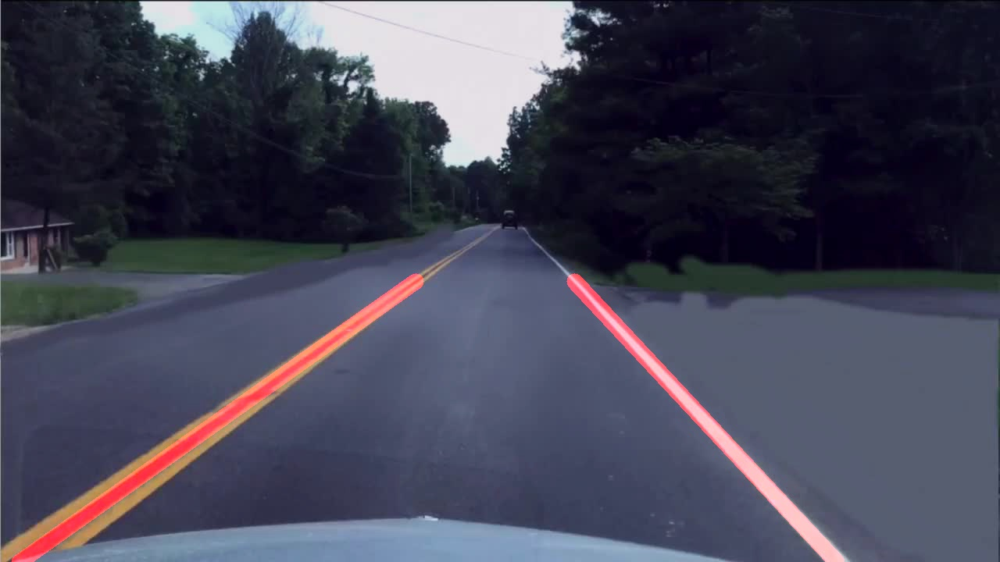

# Lane_finder
Lane-Detection for Autonomous Vehicles

# Concepts and Methods used to achieve real-time lane detection

  # 4 Step summary:
    1. Conversion of the image to greyscale -Intended to remove color gradients
    2. Applying Gaussian Blur
    3. Identifying Canny Edges
    4. Potraying indicators

# Output

